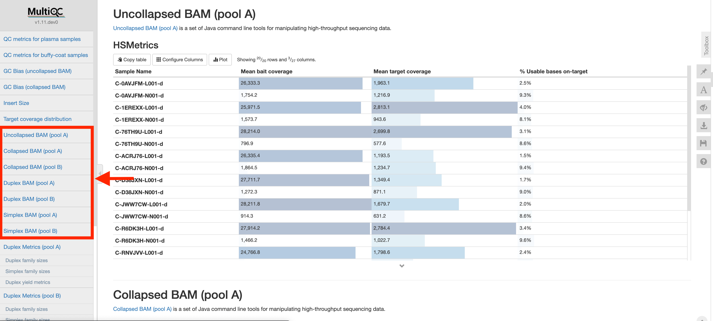

### Introduction

There are several sections displaying bait set capture efficiency. Each section corresponds to a separate BAM type and bait set combination. The tool used to produce the metrics is GATK-CollectHsMetrics. By default, only the mean bait coverage, mean target coverage, and % Usable bases on-target are displayed. However, there are many more metrics that can be toggled to display by clicking on the `Configure Columns` button.

### Methods
**Tool used:** [GATK-CollectHsMetrics](https://gatk.broadinstitute.org/hc/en-us/articles/360036856051-CollectHsMetrics-Picard-) 
**BAM type:** (1) Uncollapsed BAM, (1) Collapsed BAM, (1) Duplex BAM, and (4) Simplex BAM 
**Regions:** Pool A and Pool B

### Interpretation

The aim is to have high coverage across Pool A and Pool B panels.
