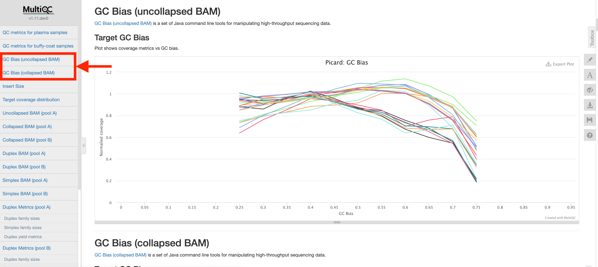

### Introduction

Coverage of each genomic region in the ACCESS panel is grouped on a per-sample basis, and a distribution of these values is plotted. Each sample is normalized by the median coverage value of that sample to align all peaks with one another and correct for sample-level differences.

### Methods
**Tool used:** GATK-CollectHsMetrics
**BAM type:** (1) collapsed BAM and (2) uncollapsed BAM.
**Region:** Pool A

### Interpretation

Extreme base compositions, i.e., GC-poor or GC-rich sequences, lead to an uneven coverage or even no coverage of reads across the genome. This can affect downstream small variant and copy number calling. Both of which rely on consistent sequencing depth across all regions. Ideally this plot should be as flat as possible. The above example depicts a slight decrease in coverage at really high GC-rich regions, but is a good result for ACCESS.
