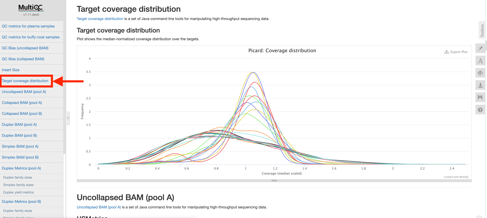

### Introduction

Coverage of each genomic region in the ACCESS panel is grouped on a per-sample basis, and a distribution of these values is plotted. Each sample is normalized by the median coverage value of that sample to align all peaks with one another and correct for sample-level differences.

### Interpretation

Each distribution should be unimodal, apart from a second peak on the low end due to X chromosome mapping from male samples. Narrow peaks are indicative of evenly distributed coverage across all bait regions. Wider distributions indicate uneven read distribution, and may be correlated with a large GC bias. Note that the provided bed file lists start and stop coordinates of ACCESS design probes, not the actual genomic target regions.
