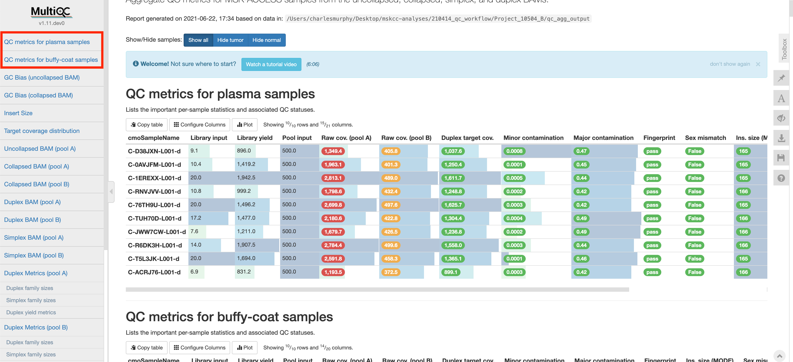

### Introduction

At the top of the MultiQC report are one or two tables showing some per-sample information. One table is for plasma samples and another is for buffy-coat samples; so only one table may show up depending on your sample composition.

### Interpretation

In the above figure you'll notice that most columns are highlighted as either red, yellow or green, which indicates if the metric fails, is borderline, or passes the thresholds set for each, respectively. This allows you to quickly glance at all samples to see where potential issues are. Below are the descriptions for each column and were the data was obtained from.

| Column name | Source | Description |
|-|-|-|
| cmoSampleName | LIMS | The sample name. |
| Library input | LIMS | The library input. |
| Library yield | LIMS | The library yield. |
| Pool input | LIMS | The pool input. |
| Raw cov. (pool A) | MEAN_TARGET_COVERAGE column from GATK-CollectHsMetrics (uncollapsed BAM, pool A). | The mean sequencing coverage over target regions in Pool A. |
| Raw cov. (pool B) | MEAN_TARGET_COVERAGE column from GATK-CollectHsMetrics (uncollapsed BAM, pool B). | The mean sequencing coverage over target regions in Pool B. |
| Duplex target cov. | MEAN_TARGET_COVERAGE column from GATK-CollectHsMetrics (duplex BAM, pool A). | Average coverage over pool A targets in the duplex BAM. |
| Minor contamination | [biometrics](https://github.com/msk-access/biometrics) | Minor contamination based on biometrics. |
| Major contamination | [biometrics](https://github.com/msk-access/biometrics) | Major contamination based on. |
| Fingerprint | [biometrics](https://github.com/msk-access/biometrics) | Pass: no unexpected matches/mismatches. NA: if no samples from the same patient to compare with. Fail: has unexpected matches/mismatches. |
| Sex mismatch | [biometrics](https://github.com/msk-access/biometrics) | Do the sample's predicted and expected sex mismatch? |
| Ins. size (MODE) | MODE_INSERT_SIZE column from GATK-CollectHsMetrics (Duplex BAM). | The most frequently occurring insert size. |
| N reads | TOTAL_READS column from GATK-CollectHsMetrics (uncollapsed BAM). | Total reads sequenced (uncollapsed) |
| % Aligned | PCT_PF_UQ_READS_ALIGNED column from GATK-CollectHsMetrics (uncollapsed BAM). | Percentage of reads aligned to the genome. |
| % Noise | [sequence_qc](https://github.com/msk-access/sequence_qc) | Percentage of noise. |
| N noise sites | [sequence_qc](https://github.com/msk-access/sequence_qc) | Number of sites contributing to noise. |
