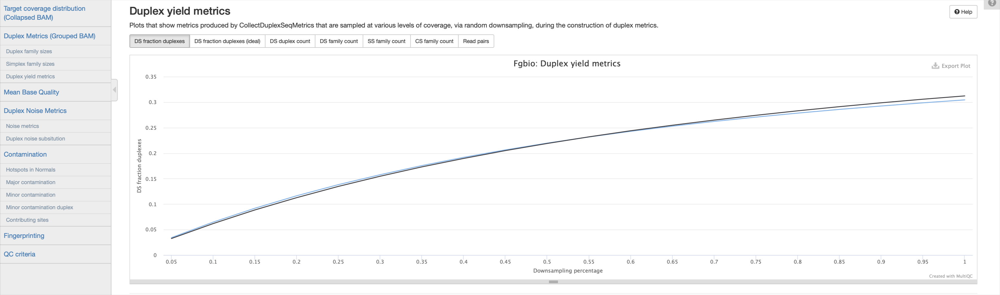

# Duplex yield metrics

Metrics produced by `CollectDuplexSeqMetrics` that are sampled at various levels of coverage, via random downsampling, during the construction of duplex metrics. The downsampling is done in such a way that the `fraction`s are approximate, and not exact, therefore the `fraction` the field should only be interpreted as a guide, and the `read_pairs` field used to quantify how much data was used.

